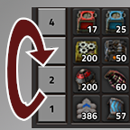
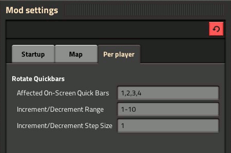
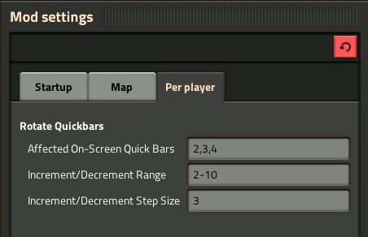
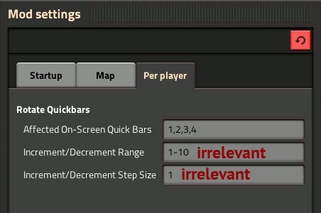

[][donate_url]

# Rotate Quickbars

A factorio (>=0.17) mod.

Adds the ability to rotate quickbars up or down, as well as to increment or decrement quickbars. You choose which quickbars. You choose which presets to include.

By default, Factorio only provides the option to rotate the quickbars in a single direction (defaults to 'x' on most keyboard layouts).

## Examples

### Scroll through all quickbars

Set "Increment quickbars" and "Decrement quickbars" in your Controls settings.

Then, to scroll through all of your quickbars in all screen quickbar placements, set these options:

Demo:

### Set up 3 sets of secondary quickbars

Set "Increment quickbars" and "Decrement quickbars" in your Controls settings.

Then, to scroll only quickbars 2, 3, and 4 and to have them scroll by _3_ each time, set these options:

Demo:

### Rotate whatever quickbars are shown

Factorio provides this by default, but in only one direction (default to 'X').

Set "Rotate quickbars up" and "Rotate quickbars down" in your Controls settings.

Then, just set which screen quickbar placements you want to have affected:

Demo:

## Install

Install from Factorios built-in mod search, or from https://mods.factorio.com/mod/RotateQuickbars

## Team

Thanks for your excitement about my work. For more about me, check out [https://www.rice.io](https://www.rice.io).

If you'd like, you can buy me a coffee as thanks: [][donate_url] Or [hire me](https://www.rice.io/p/consulting)!

Contributors:
- Derrick Rice <derrick@rice.io>
- _your name here!_

## License

[MIT](https://opensource.org/licenses/MIT)
copyright Derrick Rice <derrick@rice.io>

[donate_url]: https://www.paypal.com/cgi-bin/webscr?cmd=_s-xclick&hosted_button_id=5GVH9M4YZUVT4&source=url

